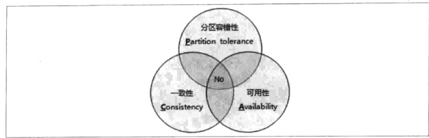

# 从Paxos到Zookeeper的分布式一致性协议原理与实践 :yum:
- ## [分布式架构](#1)
- ## [一致性协议](#2)
- ## [Zookeeper与Paxos](#3)
- ## [使用Zookeeper](#4)
- ## [Zookeeper的典型应用](#5)
- ## [Zookeeper的技术内幕](#6)
- ## [Zookeeper运维](#7)

 - ## 
分布式架构

   随着计算机系统规模变得越来越大，单机已经无法满足业务的需要。这个时候就需要多台机器甚至几千台机器运行业务，这个时候就需要考虑数据的一致性，可用性，以及如何协调成千上万台机器的工作，分布式理论由此而生。
   - ### 
从集中式到分布式

     从20世纪60年代大型主机发明出来后，凭借其超强的计算处理能力以及I/O处理能力以及在安全性稳定性的卓越表现，在很长一段时间，大型主机引领了计算机行业以及商业计算领域的发展。我所了解到的是IBM的小型机和大型机。随着这些优秀的主机的出现，集中式的计算机系统架构也成为了主流。对应的系统也被称为集中式系统。最为典型的就是阿里的淘宝系，从2008年以后，淘宝的业务进入了井喷式的发展阶段，这对于后台系统的计算与存储能力提出了非常高的要求，一味地针对小型机和高端存储进行不断扩容，会产生巨大的成本。同时集中式的系统架构体系也存在诸多单点问题，完全无法满足互联网应用爆炸式的发展需求。(_据我了解，早期淘宝是让买了一套Oracle的一套系统，基于PHP开发的，然后淘宝只需要维护和迭代就行，同时数据库也用的Oracle的，机器是IBM的，所以整套系统非常耗钱，而且业务的增长导致需要不断的扩容。到最后就算是扩容也无法满足他们的业务场景了，所以才开始了去IOE计划，改用Java重构整个系统。其电商系统也正式进入了分布式系统时代。非常佩服他们领导人的决策力。_)
     - __集中式的特点__
       所谓的集中式系统就是指由一台或多台主计算机组成中心节点，数据集中存储于这个中心节点中，并且整个系统的所有业务单元都集中部署在这个中心节点上，系统的所有功能均由中心节点处理。也就是说，在集中式系统架构中，每个终端或客户机器仅仅负责数据的录入和输出，而数据的存储与控制处理完全交由主机finish.
       集中式系统最大的特点就是部署简单，由于集中式系统往往基于底层性能卓越的大型主机，因此无需考虑如何对服务进行多节点部署，也就不用考虑多节点之间的分布式协作问题。
     - __分布式的特点__
       _分布式系统是一个硬件或软件组件分布在不同的网络计算机上，彼此之间仅仅通过消息传递进行通信和协调的系统。_
       严格来讲，分布式系统中的计算机在空间部署上是可以随意分布的，也叫异地容灾，一个标准的分布式系统在没有任何特定业务逻辑约束的情况下，有如下特征:
       - 1. 分布性
         分布式系统中的多台计算机都会在空间上随意分布，同时机器的分布情况会随时变动。
       - 2. 对等性
         分布式系统中的计算机没有主/从之分，即没有控制整个系统的主机，也没有被控制的从机，组成分布式系统的所有计算机节点都是对等的。副本是分布式系统最常见的概念之一，是分布式系统对数据和服务提供的一种冗余方式。在常见的分布式系统中，为了保证高可用，往往对数据和服务进行副本处理。副本我的理解就是在不同的节点持节化同一份数据或者服务，当一个节点的数据丢失时，或者服务不可用时，可以切换到副本节点上，这是解决分布式系统数据丢失和服务不可用问题的最为有效的手段。
       - 3. 并发性
         在"问题的提出"部分，我们已经提到过与"更新的并发性"相关的内容。在一个计算机网络中，程序运行过程中的并发性操作时非常常见的行为，例如同一个分布式系统中的多个节点，可能会并发地操作一些共享资源，诸如数据库或分布式存储等，如何准确并高效地协调分布式并发操作也成为分布式系统架构与设计中最大的挑战之一。
       - 4. 缺乏全局时钟
         典型的分布式系统是由一系列在空间上随意分布的多个进程组成的，具有明显的分布性，这些进程之间通过交换消息来进行相互通信，因此在分布式系统中，需要判断两个事件究竟谁先谁后，原因就是因为分布式系统缺乏一个全局的时钟系列控制。
       - 5. 故障总是会发生
         组成分布式系统的所有计算机，都有可能发生任何形式的故障。_黄金定理:任何在设计阶段考虑到的异常情况，一定会在系统实际运行中发生，并且，在新系统实际运行过程中还会遇到在设计时未能考虑到的异常故障，所以，除非需求指标允许，在系统设计时不能放过任何异常情况。
     - __分布式环境的各种问题__  
       - 1. 通信异常
         在集中式向分布式演变的过程中，必然引入了网络因素，而由于网络本身的不可靠性，因此也引入了额外的问题。分布式系统需要在各个节点之间进行网络通信,因此每次网络通信会伴随着网络不可用的风险,网络光纤,路由器或者DNS等硬件设备或是系统不可用都会导致最终分布式系统无法顺利完成一次网络通信,另外,即使分布式系统之间的网络通信能够正常进行,其延时也会远大于单机操作.通常我们认为在现代计算机体系中,单机内内存访问的延时在纳秒数量级,而正常的一次网络通信的延迟在0.1~1ms左右,因此消息丢失和消息延迟变得非常普遍.
       - 2. 网络分区
         当网络由于发生异常情况,导致分布式系统中部分节点之间的网络延时不断增大,最终导致组成分布式系统的所有节点中,只有部分节点之间能够进行正常通信,而另一些节点则不能,这个现象称为网络分区,也叫脑裂,当网络分区发生时,分布式系统会出现局部小集群,在极端情况下,这些局部小集群会独立完成原本需要整个分布式系统才能完成的功能,包括对数据的事务处理,这就对分布式一致性提出了非常大的挑战.    
       - 3. 三态
         在分布式系统中有三态的概念,即成功,失败与超时.
       - 4. 节点故障
         即组成分布式系统的节点出现宕机
   - ### 
从ACID到CAP/BASE

     - __ACID__
       事务是由一系列对系统中数据进行访问与更新操作所组成的一个程序执行逻辑单元,狭义上的事务特指数据库事务.事务是为了保证在多个应用程序并发访问数据库时,事务可以在这些应用程序之间提供一个隔离方法,以防止彼此的操作互相干扰.另一方面,事务为数据库操作序列提供一个从失败中恢复到正常状态的方法,并提供了数据库即使在异常状态下仍能保持数据一致性的方法
       - 原子性
         事务的原子性是指事务必须是一个原子的操作序列单元.事务包含的各项操作在一次执行过程中,只允许出现以下两种状态之一.
           - 全部执行
           - 全部不执行
         任何一项操作失败都将导致整个事务失败,同时其他已经被执行的操作都将被撤销并回滚,只有所有的操作全部成功,整个事务才算是成功完成.
       - 一致性
         事务的一致性是指事务的执行不能破坏数据的完整性和一致性,一个事务在执行之前和执行之后,数据库都必须处于一致性状态.事务的执行必须是使数据库从一个一致性状态转变到另一个一致性状态
       - 隔离性
         事务的隔离性是指在并发环境中,并发的事务是相互隔离的,一个事务的执行不能被其他事务干扰.也就是说一个事务的内部的操作及使用的数据对其他并发事务是隔离的,并发执行的各个事务之间不能相互干扰,MYSQL中使用数据快照的方式来保证隔离性.(_具体的隔离级别以及作用请去看MySQL_)
       - 持久性
         事务的持久性也被称为永久性,是指一个事务一旦提交,它对数据库中对应的数据的状态变更应该是永久性的.也就是说一个事务执行成功后,那么它对数据库所有的更新就必须被永久的保存下来,即使发生宕机,数据库重启,也会恢复到事务成功结束时的状态. 
     - __分布式事务__
       随着分布式计算的发展,单机情况下的acid事务规则已经满足不了我们的要求了,因为数据分散在各台不同的机器上,如何对这些数据进行分布式的事务处理具有非常大的挑战.
       分布式事务是指事务的参与者,支持事务的服务器,资源服务器以及事务管理器分别位于分布式系统的不同节点之上.通常一个分布式事务中会设计对多个数据源或业务系统的操作.
       - __CAP和BASE理论__
         对于本地事务或者集中式的事务处理系统,很显然我们可以采用已经被实践证明很成熟的ACID模型来保证数据的严格一致性.但是在随着分布式系统的出现,ACID已经无法满足分布式情况下对数据一致性要求的保证.尤其是在高并发高访问量的系统中,如果我们期望实现一套严格满足acid特性的分布式事务,很可能出现的情况就是在系统的可用性和严格一致性之间出现冲突-因为当我们要求分布式系统具有严格一致性时,很可能就需要牺牲掉系统的可用性.对于一致性来说,这个说有软件系统的一个刚需,因此在可用性和一致性之间无法存在一个两全其美的方案,于是如何构建一个兼顾可用性和一致性的分布式系统成为了无数工程师探讨的难题,出现了诸如cap和base这样的分布式系统经典理论.
         - CAP定理
           - _一致性(Consistency)_
            在分布式环境中,一致性是指数据在多个副本之间是否能够保持一致的特性,在一致性的需求下,当一个系统在数据一致的状态性执行更新操作后,应该保证系统的数据仍然处于一致的状态.
            在分布式系统中,如果能够做到针对一个数据项的更新操作执行成功后,所有的用户都可以读取到其最新的值,那么这样的系统被称为具有强一致性.
           - _可用性(Availability)_
            可用性是指系统提供的服务必须一直处于可用的状态,对于用户的每一个操作请求总是能够在有限的时间内返回结果.
            '有限时间内'是指对于用户的一个操作请求,系统必须能够在指定的时间(及response time) 内返回对应的处理结果,如果超过了这个时间范围,那么系统就被认为是不可用的.另外'有限的时间内'是一个系统在设计之初就设定好的系统运行指标,通常不同的系统之间会有很大的不同.'返回结果'是可用性的另一个非常重要的指标,它要求系统在完成对用户请求的处理后,返回一个正常的响应结果,正常的响应结果通常能够明确地反映出对请求的处理结果,即成功或者失败,而不是让用户感到困惑的一个结果.
           - _分区容错性(Partition tolerance)_
            分区容错性约束了一个分布式系统需要具有如下特性:分布式系统在遇到任何网络分区故障的时候,仍然需要能够保证对外提供满足一致性和可用性的服务,除非是整个网络环境都发生了故障.
            网络分区是指在分布式系统中,不同的节点分布在不同的子网络(机房或者异地网络等)中,由于一些特殊的原因导致一些子网络之间出现网络不连通的状况,但各个子网络是正常的,从而导致整个系统的网络环境分成若干个孤立的区域.需要注意的是,组成一个分布式系统的每个节点的加入与退出都可以看做是一个特殊的网络分区.
            

            | 放弃CAP定理 | 说明 |
            | --- | --- |
            | 放弃p | 如果希望能够避免系统出现分区容错性问题,一种较为简单的做法是将所有的数据或者仅仅是那些与事务相关的数据都放在一个分布式节点上.这样的做法虽然无法100%保证系统不会出错,但至少不会碰到由于网络分区带来的负面影响.但同时需要注意的是,放弃p的同时也就意味着放弃了系统的可扩展性. |
            | 放弃A | 相对于放弃"分区容错性来说",放弃可用性则正好相反,其做法是一旦系统出现网络分区或者其他故障时,那么受到影响的服务需要等待一定的时间,因此在等待期间系统无法对外提供服务,即不可用. |
            | 放弃C | 这里的放弃一致性并不是说完全的不需要数据一致性,而是放弃数据的强一致性,保留数据的最终一致性,这样系统虽然无法保证实时的一致性,但是能够承诺的是数据最终会达到一个一致性的状态.这就引入了一个时间窗口的概念,具体多久能够达到一致性取决于系统的设计,主要包括数据在不同节点之间的复制时间长短 |
            
            _在分布式系统中,分区容错性是必须要保证的一点,因为在分布式系统中,那么分区中的组件肯定部署在不同的节点上,这也就导致了一个个的子网络.而对于分布式系统而言,网络问题必然是一个会出现的异常情况._
         - BASE理论
           BASE 是 Basically Available(基本可用),Soft state(软状态)和Eventually consistent(最终一致性) 三个短语的简写.
           - 1. __*基本可用*__
             基本可用是指分布式系统在出现不可预知故障的时候,允许损失部分可用性-并不代表系统不可用
             - _响应时间的缺失_ 正常情况下,一个在线搜索引擎需要在0.5秒之内返回用户相应的查询结果,但由于出现故障,查询结果的响应时间增加到1~2秒.
             - _功能上的损失_ 正常情况下,在一个电子商务网站进行购物,消费者几乎能够顺利地完成每一笔订单,但是在一些节日大促高峰的时候,由于消费者的购物行为激增,为了保护购物系统的稳定性,部分消费者可能会被引导到一个降级页面.
           - 2. __*弱状态*__
             弱状态也称为软状态,和硬状态相比,即允许系统中的数据出现中间状态,并认为该中间状态的存在不会影响系统的整体可用性,即允许系统在不同节点的数据副本之间进行数据同步的过程存在延时.
           - 3. __*最终一致性*__
             最终一致性强调的是系统中所有的所有数据副本,在经过一段时间的同步后,最终能够达到一个一致的状态.因此,最终一致性的本质需要系统保证最终数据能够达到一致,而不需要实时保证系统数据的强一致性.亚马逊首席技术官对最终一致性的解释说:最终一致性是一种特殊的弱一致性:系统能够保证在没有其他新的更新操作的情况下,数据最终一定能够达到一致的状态,因此所有客户端对系统的数据访问都能够获取到最新的值.同时,在没有发生故障的前提下,数据达到一致状态的时间延迟,取决于网络延迟,系统负载和数据复制方案设计等因素.在实际工程中,最终一致性存在以下五类主要变种.
             - 因果一致性
               因果一致性是指,如果进程A在更新完某个数据项后通知了进程B,那么进程B之后对该数据项的访问都能够获取到进程A更新后的新值,即不能发生丢失更新的情况.与此同时,与进程A无因果关系的进程C的数据访问则没有这样的限制 
             - 读己之所写
               读己之所写是指,进程A更新一个数据项之后,它自己总是能够访问到更新过的最新指,而不会看到旧值,因此读己之所写是一种特殊的因果一致性. 
             - 会话一致性
               会话一致性将对系统数据的访问过程框定在一个会话当中:系统能保证同一个有效的会话中实现读己之所写的一致性,也就是说在执行更新操作后,客户端能够在同一个会话中始终读取到该数据项的最新值. 
             - 单调读一致性
               单调读一致性是指如果一个进程从系统中读取到一个数据项的值后,那么系统对于该进程后续的任何数据访问都不应该返回更旧的值. 
             - 单调写一致性
               单调写一致性是指,一个系统需要能够保证来自同一个进程的写操作被顺序地执行. 