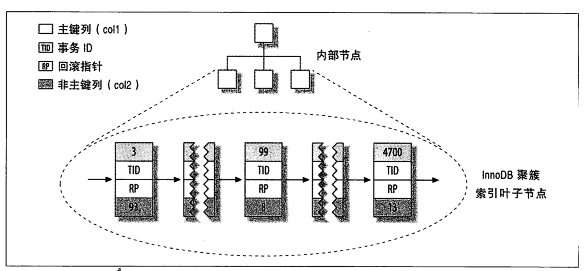
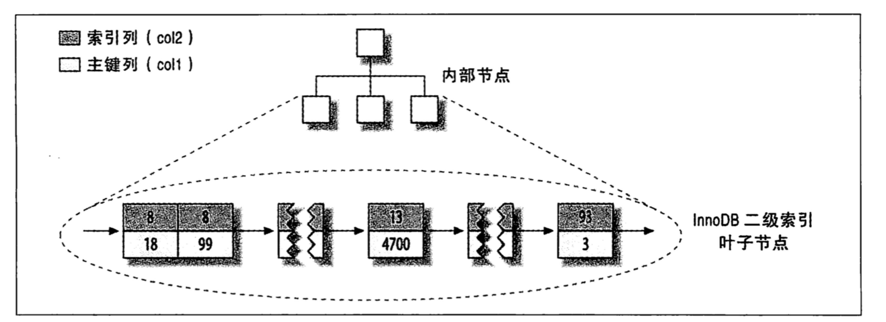
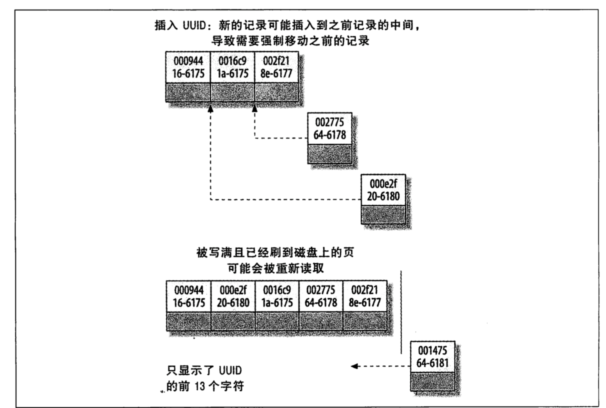

## Learn about mysql:yum:

- ## [Introduction](#1)
  - ### [What is db?](#1_1)
  - ### [Mysql? database client and database server](#1_2)
- ## [what is mysql?](#2)
  - ### [MyISAM](#2_1)
  - ### [InnoDB](#2_2)
  - ### [Use MyISAM or InnoDB?](#2_3)
  - ### [HEAP](#2_4)
  - ### [MySQL data type](#2_5)
- ## [How to use sql?](#3)
  - ### [Basic sql](#3_1)
  - ### [Advanced sql](#3_2)
- ## [How to optimize your sql?](#4)
  - ### [Create an index](#4_1)
  - ### [How to use table relationships?](#4_2)
  - ### [Query must be careful](#4_3)
- ## [Use java to manage your mysql](#5)
  - ### [connect by java](#5_1)
  - ### [use transaction by java to manage you crud](#5_2)
- ## [Appendix](#6)
  - ### [Common query](#6_1)
  - ### [Common mysql management statement](#6_2)
- ## [Data table design ideas](#7)
  - ### [Counting table](#7_1)

# Give me :+1:. Thanks

# My english is not good! hahhha:smiling_imp:

## <p id="1">简介</p>

- ### <p id="1_1">什么是数据库?</p>

  **数据库** 就是一个有一批由一批数据构成的有序集合,这个集合通常保存在一个或多个彼此相关的文件中.这些数据被分门别类的存放在一些结构化的数据表(_tables_)中,而数据又存在种种内在的交叉引用关系.存在于数据表之间的这种关系使数据库又被称为关系(型)数据库. 关系型数据库有以下几个(_mysql_ , _oracle_ _sql server_) :smile:
  **数据表** : 用来存放有关数据的框架结构.这种数据表里的每一行称为数据记录(_data record_),简称记录,每条记录的结构和格式是由人们在定义数据表时决定的.在数据表中,每条记录包含多个字段,每个字段对自己的所存储的数据类型有一定的要求(_example : it is a number field or a string field or a date field and so on. and it must less than maximum limit._)

- ### <p id="1_2">mysql? 数据库客户端还是数据库服务器</p>

  **MYSQL** 我们通常所说的 mysql 一般包含一个客户端(client)和一个服务端(server).  
  **_client_** 负责 mysql server 的数据表格(table)的管理,以及 sql 语句的执行和数据表的展示.通俗来讲 mysql-client 是 mysql-server 的管理工具,仅限于将把数据库操作命令发送给 mysql-server 服务器和把那些命令的执行结果显示给用户.
  **_server_** mysql-server 负责数据的存储,以及 sql 语句的编译和执行.通常所说的 mysql 是包含 client 和 server 的. 通俗来讲 我们的 table 都是由 mysql-server 管理的.

## <p id="2">什么是 mysql?</p>

**MySQL** 是一种客户\服务器体系的数据库系统,它的服务器端部分在启动运行后是不提供人机交互界面的,所以终端用户无法直接使用 msql,只能通过 mysql 客户端或者 WEB 站点访问数据库进行管理以及 crud 操作.

**_mysql functions_**:

- **关系数据库系统**
- **客户/服务器体系** MySql 是一种客户/服务器系统,整个系统由一个数据库服务器(MySQL)和任意多个客户(应用程序)构成.客户通过与服务器通信的方式来完成数据查询保存修改等操作.客户既可以与服务器运行在同一台计算机上,也可以运行在另一个计算机上.
- **sql 兼容性** Mysql 支持 sql(Structured Query language,结构化查询语言) 作为自己的数据库语言.SQL 是一种专门用于查询和修改数据库里数据以及对数据库进行管理和维护的标准化语言.(Mysql 遵循最新的 sql 标准)
- **子查询** Mysql 具备了对以下形式的查询进行处理的能力:

```sql
SELECT * FROM TABLE1 WHERE X IN (SELECT Y FROM TABLE2)
```

- **视图(view)** 简单地说,视图(view) 与一个被视为数据库对象并且能反应出数据库某个特定方面的 sql 查询关系. start at mysql 5.0
- **存储过程** 存储过程(stored procedure,简称 SP)用于处理被存储在数据库系统内部的 SQL 代码.存储过程常见用途是把一系列特定的连续步骤--如插入删除 and so on 简化为一个函数调用.存储过程向编写客户软件的程序员提供了这样一种便利;在程序里只需要调用一个存储过程就可以完成一系列操作,用不着直接与数据表打交道了.存储过程可以提高工作效率.mysql 5.0 开始支持存储过程.(慎用)

  1. 优点:

     1. _在生产环境下可以通过直接修改存储过程的方式修改业务逻辑(or bug),而不是重启应用服务器.但这个操作是不安全的,很多人在修改存储过程后没有经过严格的测试,可能导致出现脏数据,严重可能导致数据丢失._
     2. _执行速度快,存储过程在经过编译之后比单独一条一条执行要快.但这个效率几乎可以忽略不计.如果做大量数据的导入,同步等操作,我们可以采用其他手段_.
     3. _减少网络传输,尤其是在高并发情况下.存储过程直接在 mysql-server 中执行,所有的数据访问都在服务器内部进行,不需要传输到其他端.但基本上用户服务和数据库在同一个子网下,大数据的访问其实是受影响的是硬盘的速度,而不是网速(可使用现在的缓存数据库解决)_
     4. _方便 DBA 优化,所有的 sql 集中在一个地方,dba 会非常高兴,这一点也算是 ORM 的软肋._
        > <font style="color:red;">还不太了解 CQRS 框架的思想</font>

  2. 缺点:

     1. _SQL 本身是一种结构化查询语言,加上一些控制(赋值,循环 or 异常处理),但不是 OO 的,本质上还是过程化.面对复杂的业务逻辑,过程化语言会很吃力,即只能应用在逻辑简单的业务上._
     2. _不便于调试,SP 基本上没有很好的调试器,很多时候都是采用 print 进行调试,但这种调试对于几百行的存储过程非常不合实际._
     3. _没办法应用缓存.虽然全局临时表的方法可以做缓存,但这种方式加重了数据库的负担.如果缓存并发严重,要经常加锁,严重影响数据库效率._
     4. _无法适应数据库的切割(水平或者垂直切割),数据库切割之后,存储过程并不知道需要的数据存在哪个数据库中,在现在的业务场景中有非常大的局限性_.

- **触发器** 触发器是由数据库服务器在一些特定的数据库操作(_insert_ _update_ and _delete_ )过程中自动执行的一组 sql 命令. mysql supports it from 5.1.
- **全文搜索** 全文搜索(full-text search)简化并加快了对文本字段内单词的搜索操作.
- **镜像复制** 镜像复制(_replication_) 允许数据库管理员把某个数据库的内容动态地复制到其他计算机中,这样做的理由有两个:避免因为系统故障而中断服务,二是为了加快数据库查询速度.
- **事务** 事务是指把多个数据库操作当成一个整体(块)来对待.数据库确保操作要么全部执行要么全部不执行.即时在事务过程中出现停电,计算机崩溃或其它灾难事件发生也是如此.事务机制还可以让程序员安全地,及时地终止一组命令的执行(_并把数据库恢复到这组命令执行前的状态_) 目前 mysql 中只有 INNODB 支持事务机制.
  - 1. **事务的四个概念**
    - 1. Atomicity(原子性) 这意味着事务就像原子一样是不可分割的,数据库系统必须保证同一个事务里所有命令要么全部执行成功,要么都不会真正执行;即时系统发生崩溃也是如此.
    - 2. Consistency(稳定性) 这意味着事务在执行成功之后数据库必须处于一个稳定可用的状态.如果数据库系统发现某个数据库里的数据违反了有关的数据合法性规则(也就是在数据库里出现了非法数据) 就会立刻中断并立刻撤销已经执行过的命令,把数据库恢复到这个事务开始执行之前的状态.
    - 3. Isolation(隔离性) 这意味着多个任务可以同时独立运行,在执行过程中彼此不会干扰.每个事务看到的数据库在这个开始事务之前和结束之后的状态除了这个事务本身做的修改以外不会发生任何变化.换句话说,即使某一个事务插入,修改或删除了数据记录,只要这个事务没有被提交,与它同期进行的其它事务不会受到任何影响
    - 4. Durability(可靠性) 这意味着事务本身必须能够经受住软硬件崩溃或其它意外故障.在故障消除后仍能执行.(_InnoDB 数据表驱动程序采用的是把所有修改先写入一个日志文件,如果系统在这些修改被实际写入数据库之前发生崩溃,在 MySQL 重启后 InnoDB 数据表驱动程序将利用那个日志文件重新构造所有修改 再传输给数据库.高可用性和高速度不可兼得,所以许多数据库系统采用了一个折中的方案.InnoDB 数据表驱动程序在这方面的做法是提供一个 innodb_flush_log_at_trx_commit 选项,这个选项决定在什么时候才可以把事务保存到日志文件里._)
  - 2. **事务的隔离模式**
    - 1. READ_UNCOMMITIED select 命令在读取有关记录的时候会将 其他事务做出修改但未提交的数据展示出来.read uncommittied 不隔离 select 命令,但是隔离 update 命令
    - 2. READ COMMITTED select 命令在读取有关记录是会把已经 commit 命令提交过其他的事务做出的修改也考虑在内.这同样意味着同一个事务里完全一样的两条 select 命令可能有不同的结果.
    - 3. REPEATABLE READ select 命令在执行的时候不把其他事务的修改考虑在内.这种隔离模式完全符合 ACID 原则对 select 命令的隔离要求.
    - 4. SERIALIZABLE 这种隔离模式与 REPEATABLE READ 模式很相似,唯一的区别是这种模式会自动把普通的 select 命令也当做 select ... lock in share mode 形式的命令执行并给受影响的数据记录统统加上一个共享锁.
- **外键约束** 它们是程序员为了确保彼此关联的数据表里没有找不到目标的交叉引用而定义的一些规则.MySQL 系统中的 Innodb 数据表都支持外键约束.
- **GIS 函数** MySQL 从 4.1 版本开始支持二维地理数据的存储和处理.因此 MySQL 适合用来开发 GIS (_Geographic Information System 地理信息系统_)应用程序
- **程序设计语言** 在开发 MySQL 应用程序的时候,有一大批的 api(_application programming interface 应用编程接口_) 和软件开发库可供使用.本文只讨论 java.
- **ODBC** MySQL 支持 ODBC 接口 connector/ODBC.能够在 Microsoft Windows 环境里运行的常用编程语言.**_在 unix 系统中没有必要_**.
- **平台独立性** MySQL 客户应用程序可以在多种操作系统下运行,Mysql 本身(_即 mysql-server_) 也可以在多种操作系统中运行.
- **速度** 人们普遍认为 Mysql 是一个非常快的数据库程序,有大量的性能测试报告支持这一结论.

**_连接 mysql_** : `mysql -u name -p password -h host -P port -defautl-character-set=encode databasename`

**_mysql-client_** 客户端操作

```SQL
\c clear 放弃正在输入的命令
\h help 显示一份命令清单
\q exit or quit 退出 mysql 程序,Unix/linux 用户还可以用使用 CTRL-D 快捷键
\s status 查看 mysql 服务器的状态信息
\T[f] tee[filename] 把输入输出记载到指定文件里
\t notee 停用 tee 功能,此后,随时可以用 tee or \t 命令 把输入和输出继续记录到刚才的指定文件中,用不着再给出文件名
\u [db] use database 另行指定一个默认数据库
\. fn source filename 读取并执行某给定文件里的 sql 命令.那些命令以分号分隔
```

**_mysql-client_** 用 mysql 处理 sql 文件

```sql
mysql -u root -p dbname < backupfile.sql --将数据库导出为 sql 文件
```

**_mysqladmin_** 命令用法:

```sql
mysqladmin -uroot -p create newdb --创建一个数据库
mysqladmin -uroot -p drop olddb --删除一个数据库
```

**_mysqldump_** 数据备份:

```sql
mysqldump [options] dbname > backupfile.sql -- -u -h -p 此外,还可以通过许多其他的选项来调控备份工作的细节.mysqldump 默认编码为 utf8,如果想要指定字符集,可以使用 -default-character-set=[encoded_mode] 选项来设置
```

**_数据库设计概论_** 一切应用程序的第一阶段工作都是对数据库进行设计,这项工作的好坏对应用程序执行效率的高低,前期编程和后期维护工作的难易程度以及能否在今后灵活修改设计方案等问题将产生巨大的影响.在设计阶段埋下的隐患会在其后给开发者和使用者带来无穷的烦恼和痛苦.数据库设计方案的好坏与设计者的知识和经验是否丰富有着很大的关系.

- ### <p id="2_1">MyISAM</p>
- **MyISAM** 数据类型的特点是成熟,稳定和易于管理.只要没有特殊理由选择其他类型,就应该选用这个类型.这种数据表类型在 MySQL 内部又被分为两种,MySQL 将自行选择它认为最适当的一种来使用:
- **MyISAM Static(_静态 MyISAM_)**: 如果数据表里的数据列各自都有预先定义好的固定长度,MySQL 服务器将自动选择这种数据表类型.这种表的数据存取效率非常高,而且即使对数据表的修改非常频繁(_suck it in lots of INSERT,UPDATE and DELETE command_) 也是如此.another,这种数据库的安全性非常高,即使出现文件受损或其它问题,数据记录的提取和恢复工作也比其它类型的数据表容易.
- **MyISAM Dynamic(动态 MyISAM)**: 如果数据表中有且只有一个 VARCHAR,xxxText 或 XXBlob 字段.MySQL 将自动选择这种数据表类型.与静态 MyISAM 类型相比,这种类型的突出优点是数据表的空间需求往往小的多;存储字符串和二进制对象需要的字节数仅仅使他们的实际长度(再加上几个字节的开销).这就是数据记录可能不都是同样的长度.这样一来,如果记录被修改了,它们在数据库文件里的存储位置就可能发生变化并在原先的位置留下一个空洞.于是,在数据库文件里,同一条记录的各个字段就不一定存储在一个连续的字节块里,而是会散步在各处,当被编辑的数据表变得越来越碎片化后,数据的存取时间就会变得越来越长.因此这种类型人们经常使用 SQL 命令 _OPTIMIZE TABLE_ 或者某个优化工具进行碎片整理
- **MyISAM Compressed(压缩 MyISAM)**:动态和静态的 MyISAM 数据表都可以用 myiasmchk 工具压缩.这种压缩的效果往往可以使数据表的空间占用量减少到原来的一半以下(_与数据表的具体内容有关_).虽说以后在读取数据记录的时候需要解压缩,但在某些场合,数据表的访问速度甚至更快 - 低速硬盘+高速 cpu 的系统上体现尤其明显.压缩 MyISAM 最大的缺点就是不能对数据进行修改.
- ### <p id="2_2">InnoDB</p>

  > > MyISAM 的更新换代-InnoDB

- **事务** InnoDB 数据表里的数据库操作可以被执行为一个事务.这将允许把几条存在内在逻辑关系的 sql 命令当做一个整体来执行.如果执行时发生错误,所有的命令(而不仅仅是触发错误的命令) 都将失效.就好像从未执行过这些命令一样.another,事务机制还能改善数据库应用程序的安全性.
  > _MySQL 支持 ANSI-SQL/92 标准里定义的全部 4 中事务级别(READ UNCOMMITTED(读未提交),READ COMMITTED(读提交),REPEATABLE READ(重复读),SERIALIZABLE(顺序))_
- **数据行级锁定机制** 在执行一个事务的时候,InnoDB 数据表的驱动程序使用的是它自己内建的数据行级锁定机制(_不是 MySQL 提供的数据表级锁定机制_).也就是说,在事务执行过程中,数据表是不会被锁定的,其他用户仍可以访问它,被锁定的只是正在接受事务处理的数据记录(_而 MyISAM 数据表在执行 lock table 命令期间会将整个表锁定_).如果有许多用户正在同时对一个大数据表进行修改,数据行级锁定机制将会大大提高人们的工作效率.
  > InnoDB 驱动程序能够自动识别"死锁"现象(_两个进程各自占用着一项 对方需要的资源,同时又都在等待对方释放所占用的资源,结果是谁也不能继续执行_),并自动终止两个进程中的一个.
- **外键约束条件** 如果在数据表之间定义了关系,InnoDB 驱动程序将自动保证数据表的引用一致性在执行过 delete 后还能保持.也就是说不可能出现数据表 A 里的一条记录引用了数据表 B 里一条已经不复存在的记录的问题.专有名词:**_外键约束条件_**

```sql
FOREIGN KEY [NAME] (column) REFERENCES table2(column2)
[ON DELETE {CASCADE | SET NULL | NO ACTION |RESTRICT}]
[ON UPDATE {CASCADE | SET NULL | NO ACTION |RESTRICT}]
```

- **外键约束策略**
  - 1. **RESTRICT** _这个是默认行为,DELETE 命令将引起一个错误,但那条记录不会删除,(Delete 命令引起了一个错误并不意味着正在执行的事务半途而废,它只表明 delete 命令没有被执行而已.必须像往常一样用 commit ... rollback 命令来终止事务.)_
  - 2. **SET NULL** table2 数据表里的记录将被删除,table1 里面受影响的所有记录的 column1 字段将全部置为 NULL.这条规则的前提是 table1.column1 字段可以取值为 NULL.
  - 3. **CASCADE** table2 数据表里的记录将被删除,table1 表里受影响的记录也将被删除.
  - 4. **NO ACTION** 不做任何操作.
- **崩溃恢复** 在发生崩溃后,InnoDB 数据表能够迅速地自动恢复到一个稳定可用的状态(_前提是计算机的文件系统没有被破坏_).
- **<span style="color:red">问题和缺陷</span>**

  - **表空间的管理** MyISAM 数据表驱动程序把每个数据表分别保存在它自己的文件里,这些文件会根据实际情况增大或缩小.InnoDB 数据表驱动程序却是把所有的数据和索引都保存在一个表空间(tablespace)里.表空间由一个或多个文件构成,它们形成了一个虚拟的文件系统.这些文件在创建之后只能增大不能缩小.在管理 InnoDB 数据表时,mysqldump 命令的使用频率要比管理 MyISAM 数据表的时候高很多.
  - **数据记录的长度** InnoDB 数据表中的单条数据记录最多可以占用 8000 个字节的空间.这一限制并不包括 TEXT 和 BLOB 数据列,它们只有前 512 个字节是随其他数据列一起存储在数据库里的,超过这个长度的数据将被存放在表空间的其他页面.
  - **存储空间占用量** InnoDB 数据表的空间占用量要比同样内容的 MyISAM 数据表大很多(_最多时会有后者的两倍,这个先不做拓展,我自己也没有看过 InnoDB 的存储方式_)
  - **全文索引** InnoDB 数据表不支持全文索引
  - **GIS 数据** InnoDB 数据表不能用来保存二维地理数据
  - **COUNT 问题** 因为支持事务,InnoDB 数据表驱动程序在统计一个数据表里的记录个数时经常会遇到困难,MyISAM 会记录表中的数据量,而 Innodb 在 count(\*)的时候要逐行去统计,所以在 InnoDB 数据表上执行
    ```sql
    SELECT COUNT(*) FROM TABLE -- 命令的速度要比在 MyISAM 上慢很多
    ```
  - **数据表锁定** Innodb 驱动程序在执行事务时使用的是它自己的锁定算法. 因此要尽量避免使用 lock table ... read/write 命令.应该使用 select ... in share mode 或 select ... for/update 命令,它们将只锁定个别记录而不是锁定整个表.
  - **MySQL 数据表** 用于管理 MySQL 访问权限的 mysql 数据表不能被转化为 Innodb 数据表,必须使用 MyISAM 格式.
  - **许可证费用** 在商用 MySQL 许可证里增加 Innodb 支持将收取双倍的费用.

- ### <p id="2_3">使用 MyISAM 还是 InnoDB?</p>

  - 可以把数据库里的不同数据表设置为不同的类型,也就是说 MyISAM 数据表和 InnoDB 数据表可以同时存在同一个数据库里,这就使用户能够根据每一张表的内容数据和具体用途为它们分别选定最佳的数据类型.
    - 如果希望减少数据的空间和时间占用,MyISAM 数据表应该是首选.从另一个方面讲如果应用程序需要使用事务,需要更高的安全性,或者需要同时多个用户对数据表进行操作,InnoDB 数据表更值得考虑.

- ### <p id="2_4">HEAP</p>
  HEAP 数据表只存在于内存中,它们使用了一个散列索引(hash index),所以数据记录的存取速度非常快.HEAP 数据表主要充当临时数据表.与普通的数据表相比,HEAP 数据表在功能上受到了许多限制,其中最重要的是不允许使用 xxxBlob,xxxText,只允许使用 = 和 <=> 操作符来搜索记录(不允许使用 &lt;,&gt; &lt;= 或 &gt;= 操作符);不支持 auto_increment 属性;只允许对 not null filed 进行索引.
  与普通的数据表相比,HEAP 数据表适用于数据量相对较小,但对访问速度要求很高的场景.(HEAP 数据表只存在于内存),所以一旦 MySQL 停止运行,HEAP 数据表也会消失.
  > MySQL 还支持其他类型的数据表,因为不常用,本文不做概述.
- ### <p id="2_5">MySQL 数据类型</p>

  - 1. **整数类型**
       在默认情况下,INT 数据类型包括正数 and 负数,但如果给 INT 定义了 UNSIGNED 属性,它的取值范围仅限于正数,对 unsigned 数据列做减法计算,返回值仍将是 unsigned 整数.

  |  MySQL 数据类型   |                                                                   含义                                                                   |
  | :---------------: | :--------------------------------------------------------------------------------------------------------------------------------------: |
  |    TINYINT(m)     | 8 位整数(_1 个字节,-128~+127_),可选参数 m 给出的是 select 查询结果中的数据列宽度(Maximum Display Width,最大显示宽度),对取值范围没有影响. |
  |    SMALLINT(m)    |                                                  16 位整数(_2 个字节,从-32768~+32767_)                                                   |
  |   MEDIUMINT(m)    |                                                24 位整数(_3 个字节,从-8388608~+8388607_)                                                 |
  | INT(m),INTEGER(m) |                                               32 位整数(4 个字节,-2147483648~+2147483467)                                                |
  |     BIGINT(m)     |                                                64 位整数(8 个字节,~-2^~64 \~ ~2^~64 - 1)                                                 |
  |      SERIAL       |                                            BIGINT AUTO_INCREMENT NOT NULL PRIMARY KEY 的简写                                             |

  > 在一个整数字段的定义里,可以选择为它定义一个数据列宽度,比如 INT(4).这个参数表示最大显示宽度,它可以帮助 mysql 和各种用户操作界面把查询结果以一种整齐易读的格式显示.

  - 2. **浮点数类型**

       | MySQL 数据类型 | 含义                                                                                                                                                                                                            |
       | -------------- | --------------------------------------------------------------------------------------------------------------------------------------------------------------------------------------------------------------- |
       | FLOAT(m,d)     | 单精度浮点数,8 位精度(4 字节). 参数 m 和 d 是可选的. m 是 10 进制的总个数,d 是小数点后面的数字个数.在插入数据的时候,数值将做必要的舍入.超过范围的数值将替换为最大可能值.可以用 show warning 命令来查看警告内容. |
       | DOUBLE(m,d)    | 双精度浮点数,16 位精度(8 字节)                                                                                                                                                                                  |
       | REAL(m,d)      | DOUBLE 的同义词                                                                                                                                                                                                 |

       > 参数 m 只影响数值的显示效果,对数值的精确度没有影响.参数 d 不同,小数点后面的数字需要按照它来舍入.

  - 3. **定点数**

       | MySQL 数据类型 | 含义                                                                             |
       | -------------- | -------------------------------------------------------------------------------- |
       | DECIMAL(p,s)   | 定点数,以字符串形式保存;数字个数不限(每位数字占用一个字节,再加上 2 个字节的开销) |
       | NUMERIC,DEC    | 双精度浮点数,16 位精度                                                           |

       > 参数 p 和参数 s 分别设定了数值的数字总个数(_表示范围,最大是 65_)和小数点后面的数字个数(_精确度,最大值是 30_),MySQL 在内部把定点数保存为二进制格式:先把定点数分成小数点前面和小数点后面两个部分,并为他们各自分配 4 个字节,这 4 个字节最多可以表示 9 位数字,也就是说,DECIMAL(6,3)和 DECIMAL(18,9)都将实际占用 8 个字节.如果还有多出来的数字,就再分配一个字节来存储它们(每个字节容纳 2 位数字,但每 4 个字节容纳 9 个数字),这么算下来,DECIMAL(19,9)实际占用 9 个字节

  - 4. **日期与时间(_DATE,TIME,DATETIME,TIMESTAMP_)**

       | MySQL 数据类型 | 含义                                                                   |
       | -------------- | ---------------------------------------------------------------------- |
       | DATE           | _'2019-05-21_'格式的日期值,取值范围: _1000-01-01~9999-12-31(3 个字节)_ |
       | TIME           | _'23:59:59'格式的时间值,取值范围:$\pm$838:59:59(3 个字节)_             |
       | DATETIME       | _'2019-05-21 23:59:59'格式的 DATE 加 TIME 组合_                        |
       | YEAR           | _年份,取值范围: 100~2155(1 个字节)_                                    |

    5. **字符串(CHAR,VARCHAR,XXXtext)**

       | MySQL 数据类型 | 含义                                                                               |
       | -------------- | ---------------------------------------------------------------------------------- |
       | CHAR(n)        | 固定长度的字符串,最多 255 个字符                                                   |
       | VARCHAR(n)     | 可变长度的字符串,最多 255 个字符(_MySQL4.1 及以前:n<256 MySQL 5.0.3 以后:n<65535_) |
       | TINYTEXT       | 可变长度的字符串,最多 255 个字符                                                   |
       | TEXT           | 可变长度的字符串,最多 (2^16-1)个字符                                               |
       | MEDIUMTEXT     | 可变长度的字符串,最多(2^24 -1)个字符                                               |
       | LONGTEXT       | 可变长度的字符串,最多(2^32 -1)个字符                                               |

       > varchar 和 xxxText 类型的数据长度是可变的,它们占用的存储空间由它们的实际长度决定.
       >
       > > varchar 和 xxxText 类型看起来是一样的,最大长度都是(65535)个字符,但在细节上有一些区别.varchar 数据列的最大字符长度必须在声明表时设置,超长的字符串在存储时会被截短,xxxText 根本不允许为它设置一个最大长度.(唯一的限制是特定文本类型的最大长度.)

  - **视图** 视图(view) 使得人们可以为一个或多个数据表定义一个特殊的表现形式.视图在行为上和数据表没有什么区别 (_可以使用 select 查询命令去查询数据,还可以(但要取决于视图的具体定义)使用 insert,update 和 delete 命令修改数据._) start at mysql5.0
    - 1. 使用视图的理由:
      - 1. **安全** 有时候可能不想让某个特定的数据库用户有权对某个数据表进行任何访问,这方面最典型的例子就是公司里的员工个人资料表,有些数据应该可以让全体员工可以访问到,但是有些数据就不应该是这样.
      - 2. **方便** 在许多应用程序中,人们经常需要执行同样的查询去根据某种要求从一个或多个数据表里收集数据.让那么多用户或程序员重复输入同一个 select 语句显然不是最佳的方法.于是,作为数据库管理员,可以定义一个视图为大家提供方便.
    - 2. 视图的定义:
      - 1.  视图相当于一个虚拟的数据表,而这个虚拟数据表的内容是某个 select 命令执行的结果.
      ```sql
      create view v1 as select id,name,homeland from author;
      select * from v1 limit 5;
      create view v2 as
      select author.id as a_id, author.name as a_name, book.id as b_id, book.name as b_name
      from author,book,author_book
      where author.id = author_book.author_id
      and book.id = author_book.book_id;
      ```
      - 1.  在视图里修改数据,能不能在视图里面修改数据(或者说这个视图是不是可刷新的)要取决于当初用来定义这个视图的 select 命令,可刷新的视图需要满足以下几个条件
        - 1.  当初用来定义视图的 select 语句不能包含 group by,distinct,limit,union 或者 having 等子命令.
        - 2.  如果某个视图里的数据来自于一个以上的数据表,那它几乎是不能刷新的.
        - 3.  视图应该包含主键,唯一索引,外键约束条件所涉及的全部数据列,如果视图里面没有或缺少这样的数据列,就将由 mysql 的选项 updateable*views_with_limit 来决定是允许刷新并同时返回一条警告信息(默认设置),还是不允许刷新并触发一个错误(设置为 0).
              *视图的完整语法\*
        ```sql
        create [or replace] [algorithm = undefined | merge | temptable] view name [column(list)] as select command [with [cascaded | local] check option]
        ```

## <p id="3">如何使用 sql?</p>

- 1. **三大范式**
  - 1. 第一范式
    - 1. 内容相似的列必须消除(_消除的方法是再创建一个表来存放它们_)
    - 2. 必须为每一组相关数据分别创建一张表
    - 3. 每条数据必须有一个主键来标识
  - 2. 第二范式
    - 1. 只要数据列的内容出现重复,就意味着应该把表拆分为多个字表
    - 2. 拆分形成的表必须用外键关联
  - 3. 第三范式
    - 1. 与主键没有关系的列必须消除
- 2. 索引

  - 1. **索引(_index_)** 是一种特殊的文件(Innodb 中的索引是表空间的一个组成部分),它们包含着对数据表里所有记录的引用指针.
       > 索引不是万能灵药,它们可以加快数据检索操作,但会是数据修改变慢,每修改一条数据,索引就必须刷新一次,为了弥补这个缺陷,许多 SQL 命令都有一个 _DELAY_KEY_WRITE_ 选项,这个选项的作用是暂时制止 MySQL 在插入 or 更新一条记录的时候立即刷新索引,对索引的修改将在全部插入或者全部修改成功之后刷新.在需要把许多新纪录插入某个数据表的场合,非常适用.
       > 索引的另一个缺陷就是会占用很大的空间,因此应该只为经常查询和最经常排序的数据列建立索引.
  - 2. **InnoDB** 索引限制
    - 1.  如果 WHERE 子句的查询里包含 _!=_ 将无法使用索引.如果对 WHERE 字句的字段使用函数将无法使用索引.
    - 2. 在 JOIN 操作中(需要从多个表提取数据时),MySQL 只有在主键和外键数据类型相同的时候才能使用索引.
    - 3. 如果 WHERE 子句的查询条件里使用了比较操作符 LIKE 和 REGEXP,MySQL 只有在搜索模板的第一个字符不是通配符的时候才能使用索引.(*example: like 'abc%' 将使用索引,like '%abc' or like '%abc%'*将不使用索引.)
    - 4. 在 ORDER BY 操作中,MySQL 只有在排序条件不是一个查询表达式的情况下才使用索引.(_虽然如此,在涉及多个数据表的查询里,即时有索引可用,那些索引在加快 order by 操作方面也没有什么作用_)
    - 5. 如果某个数据列里包含许多重复的值,即时建立索引也不会有什么好的效果.
  - 3. **Innodb 索引类型(_普通索引,唯一索引 and 主索引_)**
    - 1. **普通索引(index)**
         *普通索引(由关键字 key or index 定义的索引)的唯一任务是加快对数据的访问速度.因此,应该只为那些经常出现在 where 子句 or order by 子句的字段加上索引.只要有可能,就应该使用最整齐,最紧凑的数据列(*比如说一个整数类型的数据列*)来创建索引*
    - 2. **唯一索引(unique index)**
         _普通索引允许被索引的数据列包含重复的值,如果能确定某个数据列将只包含彼此各不相同的值,很多情况下人们创建唯一索引的目的不是提高查询效率,而是保证唯一性._
    - 3. **主索引**
         _主键索引,必须为每张表的一个唯一字段创建一个主键索引,主键索引和唯一索引的区别就是主键索引用 primary 进行定义._
    - 4. **外键索引**
         _如果为某个外键字段定义了一个外键约束条件(一致性规则),MySQL 就会定义一个内部索引来帮助自己以最有效率的方式管理和使用外键约束条件_
    - 5. **复合索引**
         _索引可以覆盖多个数据列,如像 index(column A,column B)索引,这种索引的特点就是 MySQL 可以有选择的使用一个这样的索引,如果查询操作只需要用到 column A 数据列上的一个索引,就可以使用复合索引,index(A,B,C)可以当做(A) (A,B)(A,B,C)来使用,但不能当做 (B),(C)(B,C)来使用._

* ### <p id="3_1">基础 sql</p>

  - 1. **简单 sql 语句**

  ```sql
  select * from table -- 返回数据表中所有记录
  select count(*) from table --返回数据表中记录的总数量
  select count(distinct publid) from table -- 确定数据表中有多少不重复的数据记录.
  select columnA,columnB from table -- 限制数据表返回的字段.
  select columnA,columnB from table limit 5 -- 限制数据表返回数据的个数.
  select columnA,columnB from table order by columnA --对查询结果进行排序.
  select columnA,columnB from table order by columnA collate utf8mb4_bin -- 采用编码方式提供的排序.
  alter table author modify name varchar(60) CHARACTER SET utf8mb4_bin collate utf8mb4_bin -- 永久修改某个数据列的排序方式.
  select * from author where id = 1; -- 筛选数据记录.
  select * from author where name like '%abc%' -- 使用 like 进行模糊匹配.
  select * from author where id in(1,2,4) -- 使用 in 进行枚举筛选.
  ```

  - 2. **多表查询**

  ```sql
  select title,pubname from titles,publishers where titiles.pubid  = publisher.pubid --找出两张表中 pubid 相同的数据.
  select title ,pubname from titles left join publishers on title.pubid = publishers.pubid. --通过 left join 同样可以找出两张表 pubid 相同的数据.
  select title,pubname from titles left join publishers using(pubid) -- 当两张表拥有相同的字段,可以通过 using 找到某个字段相同的数据.
  select title,authorname from titles,rel_title_author,authors
  where titles.titileid = rel_title_author.titleid and authors.authorid= rel_title_author.authorid order by title -- 三张表查询.
  select authorname from author
  union
  select bookname from book --合并查询,两个 select 必须返回相同个数的字段. 并以第一个查询结果需要的字段进行展示命名.
  select id as a_id, name,count(name) as a_name from author group by name; -- group by columnA 按 columnA 分类,相同数据将被合并,count(name)给出相同 value 统计数据.
  ```

  - 3. **更新,插入,删除操作**

  ```sql
  create table book_duplicate select * from book; -- 为 book 表创建一个备份.
  mysqldump -u loginName -p dbname > backupfile --为整个数据库备份.
  mysql -u loginName -p dbname  < backupfiel -- 为整个数据库恢复备份.
  mysql -u root -p
  create database dbname;
  use dbname;
  source backupfile;
  insert into tablename(columnA,columnB,...) values('str',number,...);
  select last_insert_id() --获取最后一次插入记录的 id
  update tablename set columnA = value1,columnB = value2,...
  where columnId = n ; --更新数据.
  update tablename set columnA = value1 order by name limit 10; -- 根据 name 排序并对前 10 条数据进行更新.
  update book,author,author_book set book.name='mysql_test',author.name='wenliujei_test' where book.id=author_book.book_id and author.id=author_book.author_id --关联表更新.

  ```

  - ### <p id="3_2">高级 sql</p>

    - 1. **创建数据表,数据库和索引**

    ```sql
    create database dbname; --创建数据库
    create database dbname default character set latin1 collate latin1_general_ci; --创建数据库并指定默认的字符集和排序方式.
    use dbname; -- 指定使用的数据库.
    create [temporary] table [if not exits] tblname(
         colname1 coltype coloptions refrence,
         colname2 coltype coloptions refrence,...
         [index1,index2,...]
    )engine = InnoDB default charset = csname collate = colname --创建数据表 并指定使用的数据库类型,默认编码方式和默认排序方式.

    create table computerbooks select * from titles where catid=1; --用查询结果创建一张表.

    create index indexname on tablename(column); --创建一个普通索引. 此语句只能在建表时执行.
    alter table tablename add [unique | fulltext | spatial] index indenxname; --创建索引
    create [unique| fulltext | spetial ] index indexname on tablename(column); --创建索引
    ```

    - 2. **变更数据表结构**

    ```sql
    alter table titles change title title varchar(50) NOT NULL;--变更字段
    alter table tablename add column type; --为数据表新增一个字段.
    alter table tablename change oldcolumn newcolumn type;--修改数据表的一个字段.
    alter table drop columnname;-- 删除一个数据列.
    alter table tablename add primary key (indexcolus) --增加一个主键.
    alter table tablename add index [indexname] (indexcolus) --创建一个普通索引
    alter table tablename add unique [indexname] (indexcolus)--创建一个唯一索引
    alter table tablename add foreign key [index_name] (column1) refrences table2(column) --增加一个外键约束条件.
    alter table tablename drop primary key;--删除主键索引
    alter table tablename drop index index_name;-- 删除一个普通索引
    alter table tablename drop foreign key indexname -- 删除外键索引.
    alter table tablename convert to character set charsetname; -- 修改数据表的字符集
    drop table tablename; -- 删除数据表
    drop database dbname; -- 删除数据库
    alter table table_name modify column column_name 类型;
    ```

    - 3. **show 命令**

    ```sql
    show columns from tablename; --展示 table所有的列以及属性
    ```

## <p id="4">如何优化你的 sql?</p>

- 1.  **基本函数**

```sql
concat(s1,s2,...) --合并字符串
select concat(coluname,',',columnname) from address; -- example
substr(columname,index,len) --截取字符串
select substr(columnname,1,10) from table author; --从第一位开始截取长度为 10 的字符串.
char_length(s) --返回字符串的长度.
IF(a,b,c) --对表达式求值,true 返回 b ,false 返回 c
select if(char_length(title) > 30,concat(left(title,20),'...',right(title,5)),title)
update mytable set column =replace(mycolun,'test','hahhh');--替换某个字段存储的值
select convert(title using utf8) from titles; -将字段 转换为 utf8 编码
```

- ### <p id="4_1">创建一个索引</p>
  - 1. **_introduction_**
       索引是存储引擎用于快速找到记录的一种数据结构.索引优化是对查询优化最有效的手段. mysql 中默认使用的 B+ tree 索引.
  ```sql
  create index index_name on tablename(column); --创建普通索引
  create unique index employees_first_name_index on employees(first_name); --创建唯一索引
  ```
  - 2. B-tree 索引适合全键值索引,键值范围和键前缀查找.其中键前缀 查找只适用于最左前缀查找.
       以 index( last_name,first_name,birth_date) 为例
    - 1. 全值匹配 和索引中的所有列进行匹配 where name = 'vbiso' and birth_date = '1960-01-01 01:01:01'
    - 2. 最左前缀 查找 name = 'vbiso' 的列.即只索引索引的第一列
    - 3. 匹配列前缀 查找 name = 'vib%' 的列,即 name 的前几个字符.
    - 4. 匹配范围值 查找 vbiso 和 wlj 之间的值.
    - 5. 精确破匹配某一列和范围匹配另外一列
    - 6. 只访问索引的查询 查询只需要访问索引,无需访问数据行.
         B+ tree 索引限制:
    - 1. 如果不是按照索引的最左列开始查找,即无法使用索引.
    - 2. 不能跳过索引中的列 即无法查找 last_name birth_date 的行.支持的索引只有 last_name first_name ,last_name,last_name,first_name,birth_date
    - 3. 如果查询中有某个列的范围查询,则其右边所有列都无法使用索引优化查找. example: where last_name= 'smith' and first_name = 'j%' and birth_date= '1998-12-23' 这个查询只能使用索引的前两列.因为这里 like 是个范围条件
  - 3. **索引的优点**
    - 1. 索引可以减少服务器需要扫描的数据量.
    - 2. 索引可以帮助服务器避免排序和临时表.
    - 3. 索引可以将随机 io 变为顺序 io.
  - 4. **索引合并策略**
    - 1. 当出现服务器对多个索引进行相交操作时(_通常有多个 and 条件_).通常以为着需要一个包含所有相关列的多列索引,而不是多个独立的单列索引.
    - 2. 当服务器需要对多个索引做联合操作时(通常有多个 or 条件),通常需要耗费大量的 cpu 和内存资源在算法和缓存,排序和合并操作上.尤其是当其中有些索引的选择性不高,需要合并扫描返回的大量数据的时候.
  - 5. **选择合适的索引列顺序**
    - 1.  在一个多列 B-TREE 索引中,索引列的顺序意味着索引首先按照 最左列进行排序,其次是第二列.所以,索引可以按照升序或者降序进 行扫描,以满足精确符合列顺序的 order by,group by 和 distinct 等子句的查询需求.
    - 2. 将选择性最高的列放到索引最前列.such as :
    ```sql
    SELECT * FROM PAYMENT WHERE staff_id = 2 AND customer_id = 584;
    ```
    这种情况下,是应该创建(staff_id,customer_id) or (customer_id,staff_id)这种索引呢?
    在建立索引前可以先进行统计一下,
    ```sql
    select sum(staff_id=2),sum(customer_id=584) from payment
    ```
    如果发现 staff_id 的行数远远大于 customer_id 那么根据经验法则,需要创建(customer_id,staff_id)的索引.
    <p style="color:red">这样做有一个地方需要注意,查询的结果非常依赖于选定的具体值.如果按上述办法优化,可能对其他一些条件值的查询不公平,服务器的整体性能可能变得更糟,或者其他某些查询的运行变得不如预期.</p>
  - 6. **聚簇索引**
       聚簇索引并不是一种单独的索引类型,而是一种数据存储方式.具体的细节依赖于其实现方式,单 InnoDB 的聚簇索引实际上在同一个结构中保存了 B-Tree 索引和数据行.
       当表有聚簇索引时,它的数据行实际上存放在索引的叶子页(_leaf page_).术语 "聚簇" 表示数据行和相邻的键值紧凑地存储在一起.因为无法同时把数据行存放在两个不同的地方,所以一个表只能有一个聚簇索引.
       在 InnoDB,默认使用主键聚集数据,如果没有定义主键,InnoDB 会选择一个唯一的非空索引代替.如果没有这样的索引,InnoDB 会隐式地定义一个主键来作为聚簇索引.
       **缺点**
    - 1. 聚簇索引最大限度地提高了 I/O 密集型应用的性能.但如果数据全放在内存中,访问的顺序就没有那么重要了,聚簇索引就没什么优势了.
    - 2. 插入速度严重依赖于插入顺序,按照主键的顺序插入是加载数据到 InnoDB 表中速度最快的方式.但如果不是按照主键顺序加载数据,那么在加载完成后最好使用 optimize table 命令重新组织下表.
    - 3. 聚簇索引更新索引列的代价很高,因此会强制 InnoDB 将每个被更新的行移动到新的位置.
    - 4. 基于聚簇索引的表在插入新行,或者主键被更新导致需要移动行的时候,可能面临"页分裂"的问题.当行的主键值要求必须将这一样插入到某个已满的页中时,存储引擎会将该页分裂成两个页面来容纳,页分裂会导致表中占用更多的磁盘空间.
    - 5. 聚簇索引可能导致全表扫描很慢,尤其是行比较稀疏,或者由于页分裂导致数据存储不连续的时候.
    - 6. 二级索引(非聚簇索引) 可能比想要的要更大,因为在二级索引的叶子节点包含了引用行的主键列.
    - 7. 二级索引访问需要两次索引查找,而不是一次.
         **优点**
    - 1. 可以把相关数据保存在一起,可以根据用户 id 来聚集数据,这样只需要从磁盘读取少数的数据页就能获取某个用户的全部邮件.如果没有使用聚簇索引,则每封邮件可能导致一次磁盘 I/O.
    - 2. 数据访问更快.聚簇索引将索引和数据保存在同一个 B-TREE 中,因此从聚簇索引中获取数据通常比在非聚簇索引中查找要快.
    - 3. 使用覆盖索引扫描的查询可以直接使用页节点中的主键值.
         **InnoDB 聚簇索引结构**
    - 1. 因为 InnoDB 支持聚簇索引,所以使用非常不同的方式存储同样的数据.
         
         <p style="color:red">聚簇索引就是表,聚簇索引的每一个叶子节点都包含了主键值,事务 ID,用于事务和 mvcc 的回滚指针以及所有剩余列.如果主键是一个列前缀索引,InnoDB 也会包含完整的逐渐列和剩下的其他列. 还有一点,InnoDB 二级索引的叶子节点中存储的不是行指针,而是主键值,并以此作为指向行的指针.这样的策略可以减少了当出现行移动或者数据页分裂时二级索引的维护工作.使用主键值当做指针会让耳机索引占用更多的空间,换来的好处是,InnoDB 在移动行时无需更新耳机索引中的这个指针.</p>
    - 2. **普通索引的结构图**<br/>
         
         <p style="color:red">普通索引的每一个叶子节点都包含了索引列,紧接着是主键值,InnoDB 的非叶子结点包含了索引列和一个指向下级节点的指针(下一级节点可以是非叶子节点,也可以是叶子节点),这对聚簇索引和二级索引都适用.</p>
         **在 InnoDB 表中按主键顺序插入行**
         最好避免使用随机的主键建立数据,特别是对于 I/O 密集型的应用.such as UUID, 它会使得聚簇索引的插入变得完全随机.
         - 1. 写入的目标页可能已经刷到磁盘上并从缓存中移除,或者是还没有被加载到缓存中,InnoDB 在插入之前不得不先找到并从磁盘读取目标页到内存中.这将导致大量的随机 I/O
         - 2. 因为写入是无序的,必定会造成大量的页分裂,以便为新的行分配空间.页分裂会导致移动大量数据,一次插入最小需要修改三个页而不是一个页.
         - 3. 由于频繁的页分裂,页会变得稀疏并被不规则地填充,所以最终数据会有碎片.
         
         <p style="color:red">顺序的主键什么时候会造成更坏的结果?</p>
         对于高并发负载,在 InnoDB 中按主键顺序插入可能会造成明显的争用.主键的上界会成为热点.因为所有的插入都发生在这里,所以并发可能会导致间隙锁竞争.另一个热点可能是 auto_increment 锁机制;如果遇到这个问题,则可能需要重新考虑重新设计表或者应用,或者更改 InnoDB_autoinc_lock_mode 配置.

* ### <p id="4_2">如何使用表关系</p>
  **introduction _table relationships_ here**
* ### <p id="4_3">小心你的查询</p>

  **introduction _query problem_ here**

* ## <p id="5">使用 java 管理你的 MySQL</p>

* ### <p id="5_1">java 连接 mysql</p>

  **加载驱动**

  ```java
  static String driver = "com.mysql.jdbc.Driver";

  static {
    try {
      Class.forName(driver);
    } catch (ClassNotFoundException e) {
      System.exit(1);
    }
  }

  ```

  **获取连接**

  ```java
  Connection connection = null;

  String url = "jdbc:mysql://localhost:3307/botserver";

  String user = "root";

  String password = "root";

  try {
    connection = DriverManager.getConnection(url, user, password);

    if (!connection.isClosed()) {
      System.out.println("Succeeded connecting to the database");
    }
    connection.setTransactionIsolation(Connection.TRANSACTION_REPEATABLE_READ);

    connection.setAutoCommit(false);

      Statement statement = connection.createStatement();

      String sql = "select * from book";

      ResultSet resultSet = statement.executeQuery(sql);

      while (resultSet.next()){
        System.out.println(resultSet.getLong("id"));
        System.out.println(resultSet.getString("name"));
      }

      connection.commit();
      resultSet.close();
      statement.close();
      connection.close();

    } catch (SQLException e) {
      if(Objects.nonNull(connection)) {
        connection.rollback();
      }
      e.printStackTrace();
    }
  ```

  **获取所有表和字段名称**

  ```java
  try {

  if(connection.isClosed()){
    System.exit(-1);
  }

  DatabaseMetaData metaData = connection.getMetaData();

  ResultSet tables = metaData.getTables(null, null, null, new String[]{"TABLE"});
  while (tables.next()){
    //table belong database
    System.out.println(tables.getString(1));
    //table schema 表模式
    System.out.println(tables.getString(2));
    // table name
    System.out.println(tables.getString(3));
    // table type table | view  and so on.
    System.out.println(tables.getString(4));

    //获取表中的所有字段信息
    ResultSet columns = metaData.getColumns(null, "%", tables.getString(3), "%");
    while (columns.next()){
      System.out.println(columns.getString("COLUMN_NAME"));
      System.out.println(columns.getString("TYPE_NAME"));
      System.out.println(columns.getInt("DATA_TYPE"));
      System.out.println(columns.getString("IS_AUTOINCREMENT"));

    }
    System.out.println("-------------------------------------");
  }

  } catch (SQLException e) {
  e.printStackTrace();
  }finally {
  try {
    this.connection.close();
  } catch (SQLException e) {
    e.printStackTrace();
  }
  }
  ```

* ### <p id="5_2">使用 java 对 MySQL 的 curd 进行事务管理</p>

  - **insert**
    不是预处理,有可能出现 sql 注入问题.

    ```java
    try {
      //可重复读
      connection.setTransactionIsolation(Connection.TRANSACTION_REPEATABLE_READ);
      //设置非自动提交
      connection.setAutoCommit(false);
      Statement statement = connection.createStatement();
      String sql = "insert into author(name,homeland) values('vbiso','rollback')";
      statement.execute(sql);
      String sql1 = "insert into author(name,homeland) values('vbiso','rollbakc1')";
      statement.execute(sql1);
      int a = 1 / 0; //在 commit 执行之前抛出运行时异常事务不会提交,在 commit 执行之后抛出运行时异常事务会提交.
      connection.commit();

    } catch (SQLException e) {
      e.printStackTrace();
    }finally {
      closeConnection();
    }
    ```

    自动提交,每个操作是一个事务,在多事务情况下不要使用

    ```java
      try {
      connection.setAutoCommit(true);
      Statement statement = connection.createStatement();
      String sql = "insert into author(name,homeland) values('vbiso','autoCommit')";
      boolean execute = statement.execute(sql);
      System.out.println(execute);
    } catch (SQLException e) {
      e.printStackTrace();
    } finally {
      closeConnection();
    }
    ```

    预处理执行 insert,防止 sql 注入,内置了防止 sql 注入的手段.预编译,就是服务器校验 SQL 语句的语法格式是否正确,然后把 sql 语句编译成可执行的函数,最后才是执行 SQL 语句.
    预编译语句执行过程:

    ```sql
    prepare myfun from 'insert into author(name,homeland) values(?,?)';
    set @str1='vbiso';
    set @str2='hahah';
    execute myfun using @str1,@str2;
    ```

    同时预编译语句也能优化 curd 操作,预编译语句只有再第一次的时候会进行预编译操作,下次执行的时候只需要替换对应的值就 👌 了.

    ```java
     try {
      String sql = "insert into author(name,homeland) values(?,?)";
      PreparedStatement preparedStatement = connection.prepareStatement(sql);
      preparedStatement.setString(1, "vbiso");
      preparedStatement.setString(2, "hahhah");
      preparedStatement.execute();
    } catch (SQLException se) {
      se.printStackTrace();
    }finally {
      closeConnection();
    }

    ```

    简单 sql 注入语句,预编译语句会将这条语句变成:delete from author where name ='vbiso or 1=1';
    这样这个 sql 语句在执行时查询条件就会被当做一个字符串执行.

    ```java
    //删除
     try {
      connection.setAutoCommit(true);
      String sql = "delete from author where name = ?";
      PreparedStatement preparedStatement = connection.prepareStatement(sql);
      preparedStatement.setString(1, "'vbiso' or 1=1");
      preparedStatement.execute();
    } catch (SQLException se) {
     se.printStackTrace();
    }finally {
      closeConnection();
    }
    ```

    **prepare 预编译的方式能很好的优化 sql 性能,所以建议在 curd 操作时都使用预编译的方式去做**

    ```java
    //查询
    try {
      connection.setAutoCommit(true);
      String sql = "select id,name,homeland from author limit ?,?";
      PreparedStatement preparedStatement = connection
          .prepareStatement(sql, new String[]{"id", "name", "homeland"});
      preparedStatement.setInt(1, 0);
      preparedStatement.setInt(2, 50);
      ResultSet resultSet = preparedStatement.executeQuery();
      List<author> authors = new ArrayList<>();
      while (resultSet.next()) {
        author author = new author();
        author.setId(resultSet.getLong("id"));
        author.setHomeland(resultSet.getString("homeland"));
        author.setName(resultSet.getString("name"));
        authors.add(author);
      }
      authors.forEach(System.out::println);
    } catch (SQLException e) {
      e.printStackTrace();
    } finally {
      closeConnection();
    }
    ```

    ```java
    //事务提交
     Savepoint savepoint = null;
    try {
      connection.setAutoCommit(false);
      connection.setTransactionIsolation(Connection.TRANSACTION_REPEATABLE_READ);

      String sql = "insert into author(name,homeland) values(?,?)";
      PreparedStatement preparedStatement = connection.prepareStatement(sql);
      preparedStatement.setString(1,"testTransaction");
      preparedStatement.setString(2,"transaction");
      preparedStatement.executeUpdate();

      String update = "update author set name = ? where name = ?";
      PreparedStatement preparedStatement1 = connection.prepareStatement(update);
      preparedStatement1.setString(1,"updateTransaction");
      preparedStatement1.setString(2,"testTransaction");
      preparedStatement1.executeUpdate();

      savepoint = connection.setSavepoint();

      String select = "select * from author id =1";
      PreparedStatement preparedStatement2 = connection.prepareStatement(select);
      ResultSet resultSet = preparedStatement2.executeQuery();

    } catch (SQLException e) {
      try {
        connection.rollback(savepoint);
      } catch (SQLException ex) {
      }
    }
    try {
      connection.commit();
    } catch (SQLException e) {
      e.printStackTrace();
    }finally {
      closeConnection();
    }
    ```

    ```sql
    -- sql事务提交
    set autocommit = 0; -- autoCommit is false

    start transaction ; -- begin a transaction

    insert into author(name, homeland) values ('tetsts','test'); --insert data

    insert into author(name, homeland) values ('testteee','tesddavs'); --insert data
    savepoint x; -- set rollback location

    select * from author where id= 1000; -- query by select.
    rollback to x; -- if commit transaction error, rollback from save point.
    select * from author;  -- query select.
    ```

* ## <p id="6">附录</p>

  - ### <p id="6_1">常用查询</p>

    ```sql
    create database vbiso_test default character set utf8mb4 collate utf8mb4_general_ci --创建数据库并指定编码方式.
    create table if not exists tablename()ENGINE = InnoDB default charset utf8mb4 collate utf8mb4_general_ci --创建数据表
    select * from employees into outfile '/var/lib/mysql-files/employees1.csv' fields terminated by ',' optionally enclosed by '"' escaped by '"' lines terminated by '\r\n' --导出数据到 csv

    alter table scheduler_detail modify column scheduler_name varchar(512);

    ```

  - ### <p id="6_2">常用 mysql 管理命令</p>
    ```shell
    mysqldump -u username -p dbname [tablename] > backup.sql -- 备份数据库,可以选择导出哪张表.
    mysqldump -t -u root -p employees employees > insert.sql  -- 只导出插入语句
    mysqldump --opt  -d employees -uroot -p > tables.sql --只导出表结构
    mysql -u root -p employees < tables.sql --执行创建表语句
    mysql -u root -p employees < insert.sql --执行插入数据语句
    ```

* ## <p id="7">数据表设计思考</p>
  - ### <p id="7_1">计数表</p>
    计数器表
    ```sql
    create table if not exists hit_counter(
      cnt int unsigned not null
    )engine = InnoDB;
    --每次点击
     update hit_counter set cnt = cnt+1;
    ```
    这种方式的计数表会导致在并发情况下事务因为拥有一个行锁,而导致事务串行执行,影响了效率.
    **优化方案**
    ```sql
    create table if not exists hit_counter (
      cnt int unsigned not null,
      slot tinyint unsigned not null primary key
    )Engine = InnoDB
    -- 然后预先在表中插入 100 行数据,然后随机选择一个槽进行更新
    update hit_counter set cnt = cnt + 1 where slot = rand() * 100
    --获得统计结果,可以使用聚合查询
    select sum(cnt) from hit_counter;
    ```

db.collectionName.aggregate([{
$match:{gmt_created:{$ge:NumberLong("date")}}
},{
$group:{user_id,total:{$sum:"$amount"}}
}])

./mongo/bin/mongoexport -uweike -piha0p1ng  -d wk_comm_COMMON_DB -c historySyncJobs -f userId,success,finishedTime --csv -o history_sync_jobs.csv
