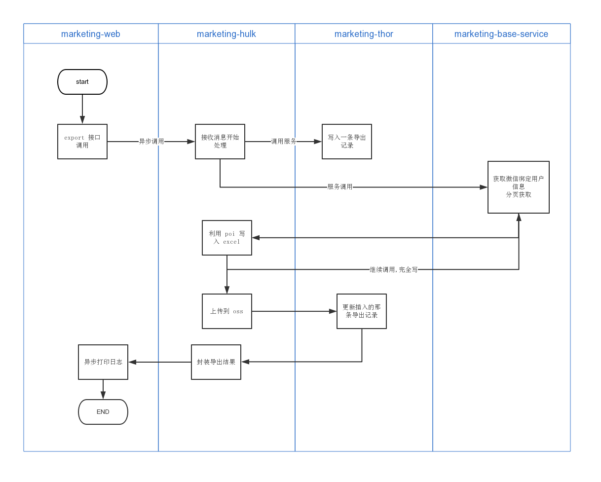

## 1. 需求分析

系统中提供了一个让用户导出 excel 表格的功能,但是这个功能刚开始设计为同步导出,就会占用 web 服务的大量内存资源,web 项目本身就是只为了给前端提供 api 的,不应该有非常大的 io 消耗操作,同时也不符合微服务规范的职责划分.因此采用异步调用的方式.

## 2. 技术方案设计(初稿)

刚开始想着直接在 web 端开个线程池,直接在线程池的异步调用.搭建一个专门为 IO 操作频繁提供解决方案的服务. 刚开始设计的方案为:


### 缺陷

因为当时考虑线程池是放在 **marketing-web** 下面的,如果这个时候发生进程 kill,那么排队中的导出任务将会丢失.这在用户看来是一个非常不可理解的操作(_业务水平仍需努力,这个估计要多练,多想,考虑各种非正常情况._).

## 3. 技术方案设计(终稿)
因为方案初稿有缺陷,所以准备考虑全部解耦,即使用 rocketmq 去做消息存储,以及消费.
```java
//TODO write final draft.
```
